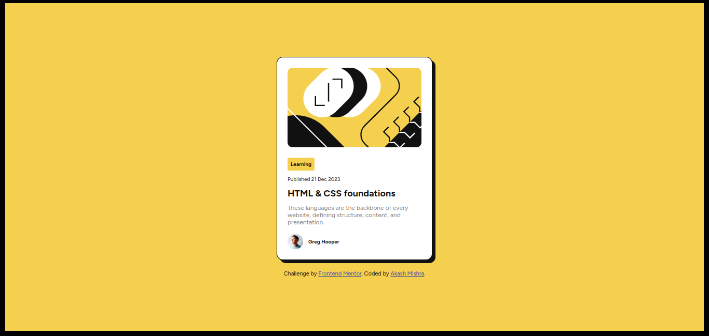
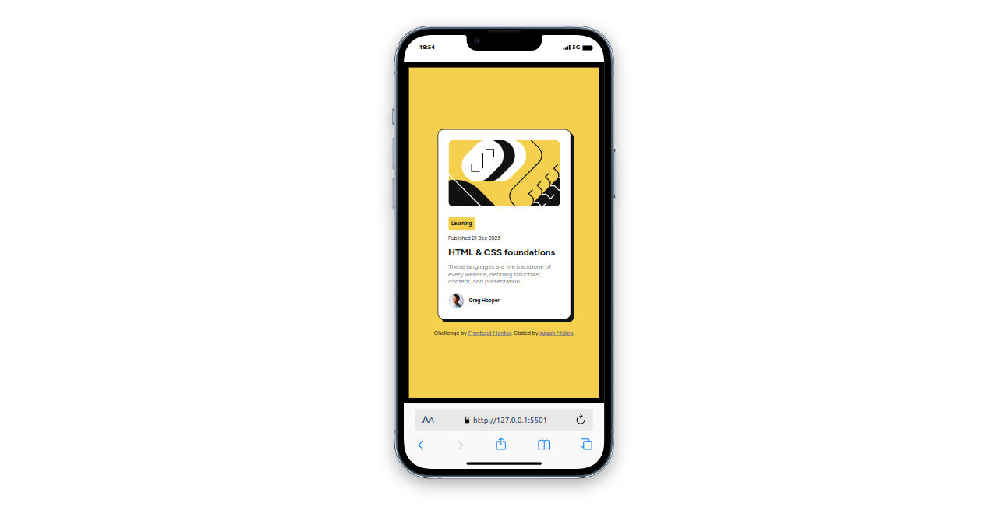

# Frontend Mentor - Blog preview card solution

This is a solution to the [Blog preview card challenge on Frontend Mentor](https://www.frontendmentor.io/challenges/blog-preview-card-ckPaj01IcS). Frontend Mentor challenges help you improve your coding skills by building realistic projects. 

## Table of contents

- [Overview](#overview)
  - [The challenge](#the-challenge)
  - [Screenshot](#screenshot)
  - [Links](#links)
- [My process](#my-process)
  - [Built with](#built-with)
  - [What I learned](#what-i-learned)
- [Author](#author)
- [Acknowledgments](#acknowledgments)

## Overview

### The challenge

Users should be able to:

- See hover and focus states for all interactive elements on the page

### Screenshot

##### Desktop-view

##### Mobile-view

### Links

- Solution URL: [Solution](https://github.com/akashmishrahaha/blog-preview-card.git)
- Live Site URL: [Live site](https://akashmishrahaha.github.io/blog-preview-card/)

## My process

### Built with

- Semantic HTML5 markup
- CSS custom properties
- Flexbox
- CSS Grid
- Mobile-first workflow

### What I learned

I learned about semantic html tags, css properties and how to add responsiveness.

## Author

- Frontend Mentor - [@akashmishrahaha](https://www.frontendmentor.io/profile/akashmishrahaha)
- Twitter - [@akashmishrahaha](https://www.twitter.com/akashmishrahaha)

## Acknowledgments

I would like to thank my peers and frontend mentor community for helping and guiding me out.
